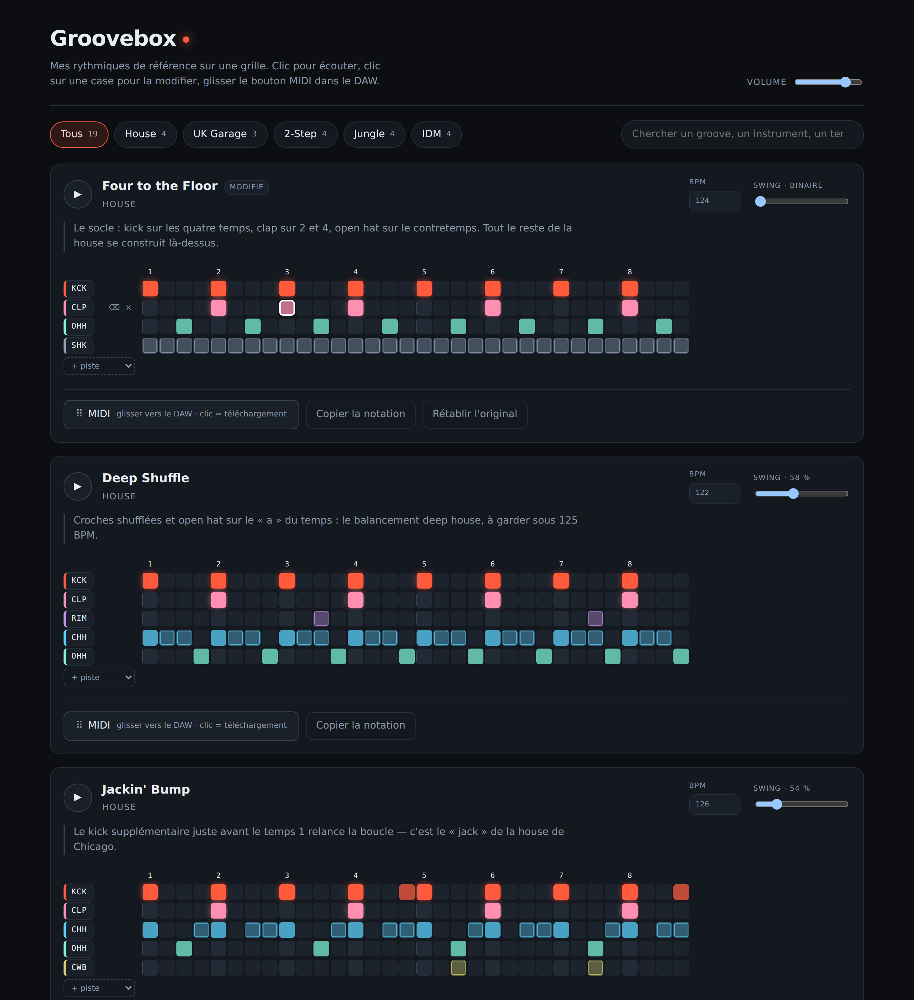

# Groovebox

Une bibliothèque personnelle de rythmiques — garage, jungle, 2-step, IDM, house —
posées sur une grille de séquenceur. On les écoute d'un clic, on les retouche
case par case, et on les glisse directement dans le DAW en MIDI.



## Ce que ça fait

- **26 grooves de référence** répartis en 6 genres — house, UK garage, 2-step,
  jungle, drum & bass, IDM — chacun sur 2 mesures en doubles-croches (32 pas).
- **Lecture instantanée** : synthèse Web Audio façon boîte à rythmes, aucun
  sample à charger.
- **Trois niveaux de frappe** : ghost note, coup normal, accent. C'est ce qui
  sépare un groove qui respire d'une boucle de métronome.
- **Swing réglable** par pattern, du binaire strict au triolet.
- **Export MIDI** en glisser-déposer vers la timeline du DAW, ou en
  téléchargement. Tempo et swing sont écrits dans le fichier.
- **Édition en place** : les retouches sont conservées d'une session à l'autre,
  avec un bouton pour rétablir l'original.

## Démarrer

```bash
npm install
npm run dev
```

| Commande | Effet |
| --- | --- |
| `npm run dev` | serveur de développement |
| `npm run build` | build de production dans `dist/` |
| `npm test` | valide les patterns, relit les fichiers MIDI produits, lint |
| `npm run validate` | vérifie la syntaxe des patterns |
| `npm run check:midi` | décode chaque export MIDI pour vérifier qu'il est lisible |

## Mapping MIDI

L'export suit la convention **General MIDI Percussion**, sur le **canal 10** :
les notes tombent donc en face des bons pads dans un Drum Rack Ableton,
Battery, ou Logic Drummer, sans remapper quoi que ce soit.

| Instrument | Note | | Instrument | Note |
| --- | --- | --- | --- | --- |
| Kick | C1 (36) | | Ride | D#2 (51) |
| Rimshot | C#1 (37) | | Crash | C#2 (49) |
| Snare | D1 (38) | | Low tom | A1 (45) |
| Clap | D#1 (39) | | Mid tom | B1 (47) |
| Closed hat | F#1 (42) | | High tom | D2 (50) |
| Pedal hat | G#1 (44) | | Shaker | A#2 (70) |
| Open hat | A#1 (46) | | Cowbell | G#2 (56) |

Le fichier est un Standard MIDI File de format 0, résolution 480 ticks à la
noire. Le swing n'est pas un réglage à part : il est **gravé dans les positions
des notes**, donc le groove reste identique une fois le fichier déposé dans le
DAW.

## Ajouter un groove

Tout est dans [`src/data/patterns.js`](src/data/patterns.js). Un pattern est un
objet, pas du code :

```js
{
  id: 'garage-mon-groove',
  name: 'Mon Groove',
  genre: 'UK Garage',
  bpm: 134,
  swing: 0.6,
  notes: "Ce qui fait marcher ce groove, en une phrase.",
  tracks: {
    kick:  'X...|X...|X...|X...|X...|X...|X...|X...',
    snare: '....|X...|....|X...|....|X...|....|X...',
    chat:  'xoxo|xo.o|xoxo|xo.o|xoxo|xo.o|xoxo|xo.o',
  },
}
```

### La notation

Un caractère par pas, 32 pas pour deux mesures :

| | |
| --- | --- |
| `X` | accent (vélocité 120) |
| `x` | coup normal (vélocité 96) |
| `o` | ghost note (vélocité 38) |
| `.` | silence |
| `\|` | séparateur de temps, purement visuel — ignoré à la lecture |

Les identifiants de piste disponibles sont ceux de
[`src/data/instruments.js`](src/data/instruments.js) : `kick`, `snare`, `clap`,
`rim`, `chat`, `phat`, `ohat`, `ride`, `crash`, `ltom`, `mtom`, `htom`,
`shaker`, `cowbell`, `conga`.

Le plus simple pour créer un pattern : partir d'un groove existant dans
l'interface, le modifier à la souris, puis cliquer sur **Copier la notation** —
les lignes obtenues se collent telles quelles dans `patterns.js`.

### Vérifier

```bash
npm run validate
```

Le script refuse les lignes qui ne font pas 32 pas, les instruments inconnus,
les identifiants en double — et signale les patterns dont **le swing ne sert à
rien** : si toutes les frappes tombent sur des doubles paires, le réglage de
shuffle est décoratif et le groove sonnera binaire. C'est presque toujours une
ligne de hats écrite en croches au lieu de doubles.

## Raccourcis

| | |
| --- | --- |
| Clic sur une case | silence → normal → accent → ghost → silence |
| Alt-clic / clic droit | efface la case |
| Clic sur le nom d'un instrument | écoute l'instrument seul |
| `Échap` | arrête la lecture |

## Déploiement

Un push sur `main` publie le site sur GitHub Pages via
[`.github/workflows/deploy.yml`](.github/workflows/deploy.yml). Il faut activer
Pages une fois dans **Settings → Pages → Source : GitHub Actions**.

## Notes techniques

- **Ordonnancement audio** : un timer JavaScript ne suffit pas à tenir un tempo.
  Le séquenceur suit le principe de *A Tale of Two Clocks* — un intervalle
  imprécis réveille le code toutes les 25 ms, qui programme les frappes à
  l'avance sur l'horloge précise du contexte audio.
- **Aucune dépendance audio ni MIDI.** Les percussions sont synthétisées
  (oscillateurs, bruit filtré, six carrés inharmoniques pour les cymbales) et
  l'écriture du fichier MIDI tient dans
  [`src/lib/midi.js`](src/lib/midi.js).
- **Le glisser-déposer vers le DAW** repose sur `DownloadURL`, que Chrome
  transforme en vrai fichier sur le disque. Sur les navigateurs qui ne le
  gèrent pas, le clic sur le même bouton télécharge le `.mid`.
